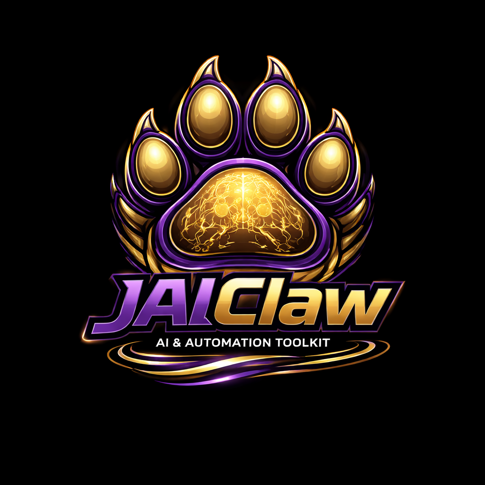

<p align="center">
  
</p>

<h1 align="center">JaiClaw</h1>

<p align="center">
  <em>The Java framework for building AI assistants that actually ship.</em>
</p>

<p align="center">
  <a href="https://www.oracle.com/java/technologies/javase/jdk21-archive-downloads.html"></a>
  <a href="https://spring.io/projects/spring-boot"></a>
  <a href="LICENSE"></a>
  <a href="#channels"></a>
  <a href="#configuration"></a>
  <a href="jaiclaw-examples/"></a>
</p>

---

## What Is JaiClaw?

JaiClaw *(pronounced "Jay-Claw")* is a production-ready framework for building AI assistants in Java. Connect any LLM to Telegram, Slack, Discord, Email, SMS, Signal, or Teams — with tools, skills, memory, and multi-agent planning built in.

It started as a ground-up Java port of [OpenClaw](https://github.com/openclaw/openclaw) (TypeScript/Node.js) and has since grown well beyond the original — adding enterprise multi-tenancy, GOAP-based agent planning, MCP server hosting, subscription billing, and security hardening that don't exist in the Node.js version.

Built on Java 21, Spring Boot 3.5, and Spring AI 1.1.4.

## Key Features

**7 Messaging Channels** — Telegram, Slack, Discord, Email, SMS, Signal, Teams. All support local dev mode (no public endpoint needed).

**11 LLM Providers** — Anthropic, OpenAI, Google Gemini, Ollama, AWS Bedrock, Azure OpenAI, DeepSeek, Mistral, MiniMax, Vertex AI, OCI GenAI. Swap with one env var.

**38+ Built-in Tools** — File editing, browser automation (Playwright), code tools with workspace boundaries, Kubernetes monitoring, document analysis, calendar, and more.

**GOAP Multi-Agent Planning** — [Embabel](https://github.com/embabel/embabel-agent) integration. Deterministic action sequences computed by A* search, with automatic parallelism detection and typed intermediate results.

**MCP Server Hosting** — Expose JaiClaw tools as MCP endpoints for Claude Desktop, Cursor, and other LLM clients. Plus dedicated MCP servers for Discord, Slack, and cross-channel messaging.

**Enterprise Multi-Tenancy** — JWT-based tenant isolation at the framework level. Per-tenant sessions, memory, skills, and billing.

**59 Bundled Skills** — Pre-built capabilities from system administration to content generation, loaded from markdown with YAML frontmatter.

**Security Hardening** — Six opt-in protections: HMAC webhook verification, SSRF guards, workspace path boundaries, timing-safe auth, agent-to-agent ECDH key exchange.

## Quick Start

### Option 1: Docker (easiest — just needs Docker)

```bash
git clone https://github.com/jaiclaw/jaiclaw.git
cd jaiclaw
./quickstart.sh
```

This builds the Docker image and starts the gateway. If no API key is provided, it also starts Ollama and pulls a local LLM model (~3GB download).

To skip Ollama and use a cloud LLM provider instead:

```bash
# With Anthropic
ANTHROPIC_API_KEY=sk-ant-... ./quickstart.sh

# With OpenAI
OPENAI_API_KEY=sk-... ./quickstart.sh

# With Google Gemini
GEMINI_API_KEY=... ./quickstart.sh
```

To pre-pull the Ollama image in the background while the quickstart runs:

```bash
docker pull ollama/ollama:latest
```

Test with (the API key is auto-generated at `~/.jaiclaw/api-key` on first run):

```bash
curl -X POST http://localhost:8080/api/chat \
  -H "Content-Type: application/json" \
  -H "X-API-Key: $(cat ~/.jaiclaw/api-key)" \
  -d '{"content": "hello"}'
```

### Option 2: start.sh (recommended for daily use)

After the initial build, use `start.sh` to run the gateway or interactive shell. It loads API keys from `docker-compose/.env` automatically.

```bash
# Edit API keys (one time)
vi docker-compose/.env

# Start the gateway locally (default) — requires Java 21
./start.sh

# Start the interactive CLI shell (local Java)
./start.sh shell

# Start the interactive CLI shell (Docker, no Java needed)
./start.sh cli

# Start gateway via Docker Compose
./start.sh docker

# Force rebuild from source (after code changes)
./start.sh --force-build

# Force rebuild Docker images
./start.sh --force-build docker
./start.sh --force-build cli

# Stop the Docker stack
./start.sh stop

# Tail gateway logs
./start.sh logs
```

### Option 3: setup.sh (first-time developer setup)

```bash
git clone https://github.com/jaiclaw/jaiclaw.git
cd jaiclaw
./setup.sh
```

The setup script installs Java 21 via SDKMAN (if needed), builds all modules, and launches the interactive shell. Run the onboarding wizard to configure your LLM provider:

```bash
jaiclaw> onboard
```

Or run the gateway instead:

```bash
./setup.sh --gateway
```

## Channels

All messaging channels support a **local dev mode** that requires no public endpoint:

| Channel  | Local Dev Mode       | Setup Time |
|----------|---------------------|------------|
| Telegram | Long polling        | ~2 min     |
| Slack    | Socket Mode         | ~5 min     |
| Discord  | Gateway WebSocket   | ~5 min     |
| Email    | IMAP polling        | ~3 min     |
| SMS      | Twilio webhook      | ~5 min     |
| Signal   | Signal CLI bridge   | ~10 min    |
| Teams    | Bot Framework       | ~10 min    |

Add channel tokens to `docker-compose/.env` and restart, or pass as environment variables:

```bash
# Telegram (polling mode — no webhook needed)
TELEGRAM_BOT_TOKEN=123456:ABC-DEF... \
ANTHROPIC_API_KEY=sk-ant-... \
./mvnw spring-boot:run -pl jaiclaw-gateway-app

# Slack (Socket Mode — no webhook needed)
SLACK_BOT_TOKEN=xoxb-... \
SLACK_APP_TOKEN=xapp-... \
ANTHROPIC_API_KEY=sk-ant-... \
./mvnw spring-boot:run -pl jaiclaw-gateway-app

# Discord (Gateway mode — no webhook needed)
DISCORD_BOT_TOKEN=... \
DISCORD_USE_GATEWAY=true \
ANTHROPIC_API_KEY=sk-ant-... \
./mvnw spring-boot:run -pl jaiclaw-gateway-app
```

See [docs/OPERATIONS.md](docs/OPERATIONS.md) for full channel setup instructions including Email, SMS, and production webhook configuration.

## Examples

20 example applications demonstrating JaiClaw capabilities. Each is a standalone Spring Boot app. See [docs/EXAMPLES.md](docs/EXAMPLES.md) for full details.

### Scheduling & Automation

| Example | Description |
|---------|-------------|
| [daily-briefing](jaiclaw-examples/daily-briefing/) | Scheduled morning briefing with news and weather via Telegram/Email |
| [sales-report](jaiclaw-examples/sales-report/) | Weekly sales dashboard with HTML report via Canvas |
| [price-monitor](jaiclaw-examples/price-monitor/) | Hourly price checker with SMS alerts when prices drop |
| [system-monitor](jaiclaw-examples/system-monitor/) | Daily server health analysis with Telegram reporting |

### GOAP Multi-Agent (Embabel)

| Example | Description |
|---------|-------------|
| [code-review-bot](jaiclaw-examples/code-review-bot/) | GOAP-orchestrated PR code review with structured feedback |
| [travel-planner](jaiclaw-examples/travel-planner/) | Multi-step trip planning with parallel flight/hotel search |
| [compliance-checker](jaiclaw-examples/compliance-checker/) | Document compliance verification with full audit trail |
| [incident-responder](jaiclaw-examples/incident-responder/) | DevOps incident triage with health checks, log queries, and remediation |
| [data-pipeline](jaiclaw-examples/data-pipeline/) | ETL orchestrator with schema validation and human-in-the-loop approval |

### Documents & Knowledge

| Example | Description |
|---------|-------------|
| [document-qa](jaiclaw-examples/document-qa/) | PDF ingestion and semantic search Q&A with citations |
| [telegram-docstore](jaiclaw-examples/telegram-docstore/) | Telegram bot for document management and semantic search |
| [research-assistant](jaiclaw-examples/research-assistant/) | Multi-source research with structured report generation |
| [content-pipeline](jaiclaw-examples/content-pipeline/) | Multi-modal content analysis for images, audio, and PDFs |

### Communication & Voice

| Example | Description |
|---------|-------------|
| [meeting-assistant](jaiclaw-examples/meeting-assistant/) | Meeting transcription, speaker identification, and Slack summaries |
| [helpdesk-bot](jaiclaw-examples/helpdesk-bot/) | Multi-tenant support bot with FAQ search and ticket creation |
| [voice-call-demo](jaiclaw-examples/voice-call-demo/) | Telephony with outbound reminders and inbound customer service via Twilio |

### Security

| Example | Description |
|---------|-------------|
| [security-handshake](jaiclaw-examples/security-handshake/) | LLM-driven ECDH key exchange and session token bootstrap |
| [security-handshake-server](jaiclaw-examples/security-handshake-server/) | MCP server implementing full ECDH P-256 security handshake protocol |
| [oauth-provider-demo](jaiclaw-examples/oauth-provider-demo/) | OAuth-gated LLM access with PKCE and device code flows |

### Developer Tools

| Example | Description |
|---------|-------------|
| [code-scaffolder](jaiclaw-examples/code-scaffolder/) | Project scaffolding agent that generates complete project structures from templates |

## Architecture

JaiClaw is composed of **65+ Maven modules** that can be mixed and matched via dependency composition. The same `AgentRuntime` scales from a personal CLI to a multi-tenant enterprise platform.

```
jaiclaw-core              Pure Java domain model (no Spring dependency)
jaiclaw-channel-api       ChannelAdapter SPI, attachments, channel registry
jaiclaw-config            @ConfigurationProperties records
jaiclaw-tools             Tool registry + built-in tools + Spring AI bridge + Embabel bridge
jaiclaw-agent             Agent runtime, session management, prompt building
jaiclaw-skills            Skill loader + versioning + tenant-aware registry
jaiclaw-plugin-sdk        Plugin SPI, hooks, discovery
jaiclaw-memory            Memory search (in-memory + vector store)
jaiclaw-security          JWT auth, tenant resolution, SecurityContext
jaiclaw-documents         Document parsing (PDF, HTML, text) + chunking pipeline
jaiclaw-gateway           REST + WebSocket + webhook + MCP + observability (library)
jaiclaw-channel-telegram  Telegram adapter (polling + webhook + file attachments)
jaiclaw-channel-slack     Slack adapter (Socket Mode + Events API)
jaiclaw-channel-discord   Discord adapter (Gateway + Interactions)
jaiclaw-channel-email     Email adapter (IMAP polling + SMTP + MIME attachments)
jaiclaw-channel-sms       SMS/MMS adapter (Twilio REST API + webhook)
jaiclaw-media             Async media analysis SPI (vision/audio LLM pipeline)
jaiclaw-messaging         MCP server: channel messaging tools (send, broadcast, sessions, agent chat)
jaiclaw-audit             Audit logging SPI + in-memory implementation
jaiclaw-spring-boot-starter  Auto-configuration for all modules
jaiclaw-gateway-app       Standalone gateway server (runnable)
jaiclaw-shell             Spring Shell CLI (runnable)
```

See [docs/ARCHITECTURE.md](docs/ARCHITECTURE.md) for the full module graph, message flow diagrams, and Kubernetes deployment patterns.

## Configuration

Configuration lives in a `.env` file. By default this is `docker-compose/.env`, but you can choose `~/.jaiclaw/.env` (persists across projects) during first run or via `./quickstart.sh --reconfigure`. The chosen location is saved in `~/.jaiclawrc` and respected by all scripts.

You can also set `JAICLAW_ENV_FILE` directly to point to any `.env` file.

| Variable | Default | Description |
|----------|---------|-------------|
| `JAICLAW_SECURITY_MODE` | `api-key` | Security mode: `api-key`, `jwt`, or `none` |
| `JAICLAW_API_KEY` | (auto-generated) | Custom API key for `api-key` mode |
| `AI_PROVIDER` | `anthropic` | LLM provider: `anthropic`, `openai`, `ollama`, `google-genai`, `bedrock`, `azure-openai`, `deepseek`, `mistral-ai`, `minimax`, `vertex-ai`, `oci-genai` |
| `ANTHROPIC_API_KEY` | | Anthropic API key |
| `ANTHROPIC_MODEL` | `claude-sonnet-4-5` | Anthropic model name |
| `OPENAI_API_KEY` | | OpenAI API key |
| `GEMINI_API_KEY` | | Google Gemini API key |
| `OLLAMA_ENABLED` | `false` | Enable Ollama local LLM |
| `GATEWAY_PORT` | `8080` | Gateway HTTP port |

See [docs/OPERATIONS.md](docs/OPERATIONS.md) for the full environment variable reference.

## Security

The gateway protects `/api/chat` and `/mcp/**` endpoints with API key authentication by default. On first run, a key is auto-generated at `~/.jaiclaw/api-key` and printed in the curl examples by the launcher scripts.

```bash
# Disable security for local development
JAICLAW_SECURITY_MODE=none ./start.sh local

# Use a custom API key
JAICLAW_API_KEY=my-custom-key ./start.sh local
```

The `onboard` wizard and `quickstart.sh --reconfigure` also allow configuring the security mode interactively. See [docs/OPERATIONS.md](docs/OPERATIONS.md) for full details.

## Running the Interactive Shell

The shell provides a Spring Shell CLI for chatting with the agent directly in your terminal.

```bash
./start.sh shell       # local Java (requires Java 21)
./start.sh cli         # Docker (no Java needed)
```

Or with Maven directly:

```bash
ANTHROPIC_API_KEY=sk-ant-... ./mvnw spring-boot:run -pl jaiclaw-shell
```

### Shell Commands

| Command | Description |
|---------|-------------|
| `chat <message>` | Send a message to the agent |
| `new-session` | Start a fresh chat session |
| `sessions` | List active sessions |
| `session-history` | Show messages in the current session |
| `status` | Show system status |
| `config` | Show current configuration |
| `models` | Show configured LLM providers |
| `tools` | List available tools |
| `plugins` | List loaded plugins |
| `skills` | List loaded skills |
| `onboard` | Interactive setup wizard |

## Scripts

| Script | Purpose |
|--------|---------|
| `start.sh` | **Daily driver** — start gateway (Docker or local), interactive shell (local or Docker). Reads `docker-compose/.env` for config. Use `--force-build` to rebuild Docker images. |
| `quickstart.sh` | **First-time Docker setup** — clones, builds image, starts stack, pulls Ollama if needed. Use `--force-build` to rebuild, `--reconfigure` to re-run interactive setup. |
| `setup.sh` | **First-time developer setup** — installs Java 21, builds from source, launches shell or gateway. |

## Building from Source

```bash
export JAVA_HOME=$HOME/.sdkman/candidates/java/21.0.9-oracle

# Compile
./mvnw compile

# Run tests
./mvnw test

# Package as JARs
./mvnw package -DskipTests

# Install to local Maven repo
./mvnw install -DskipTests
```

## Docker Images

Two modules produce Docker images via [Eclipse JKube](https://eclipse.dev/jkube/):

```bash
# Build gateway image
./mvnw package k8s:build -pl jaiclaw-gateway-app -am -Pk8s -DskipTests

# Build shell image
./mvnw package k8s:build -pl jaiclaw-shell -am -Pk8s -DskipTests
```

Images use `eclipse-temurin:21-jre` base and follow `io.jaiclaw/<module>:<version>` naming.

## Documentation

| Document | Description |
|----------|-------------|
| [What Is Agentic AI?](docs/WHAT-IS-AGENTIC-AI.md) | Plain-English explainer for non-technical audiences |
| [Architecture](docs/ARCHITECTURE.md) | Module graph, message flow, Kubernetes deployment |
| [Operations Guide](docs/OPERATIONS.md) | Running, configuring, deploying, full env var reference |
| [Agentic Workflow](docs/AGENTIC-WORKFLOW.md) | Tool loop, human-in-the-loop, context compaction, memory |
| [Examples Guide](docs/EXAMPLES.md) | Detailed walkthrough of all example applications |
| [Enterprise Scaling](docs/JAICLAW-FROM-PERSONAL-TO-ENTERPRISE.md) | From personal assistant to multi-tenant platform |
| [Feature Comparison](docs/FEATURE-COMPARISON.md) | OpenClaw vs JaiClaw vs Embabel — full feature matrix |
| [Telegram Setup](docs/TELEGRAM-SETUP.md) | Step-by-step Telegram bot configuration |

## Contributing

Contributions are welcome! Whether it's bug reports, feature requests, documentation improvements, or code — we appreciate it all.

1. Fork the repository
2. Create a feature branch (`git checkout -b feature/my-feature`)
3. Commit your changes
4. Push to the branch and open a Pull Request

Please open an issue first for large changes so we can discuss the approach.

## License

Licensed under the [Apache License, Version 2.0](LICENSE).
