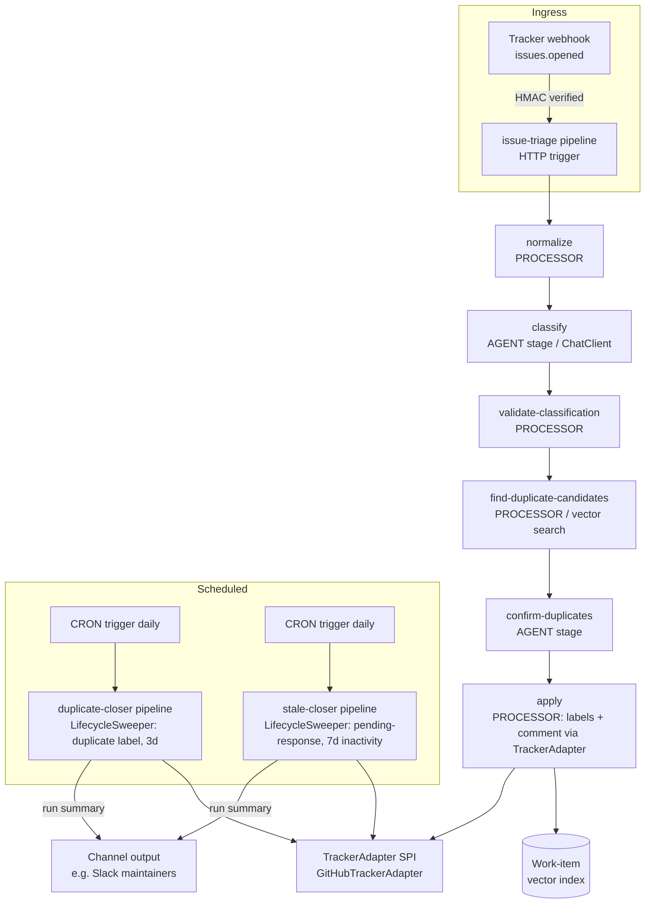

# Implementation Document: Work-Item Triage & Issue Organizer (JaiClaw)

*A JaiClaw-native re-architecture of the **reference example implementation (REI)** — a TypeScript / GitHub Actions issue-automation design — generalized from "GitHub issues" to "work items from any tracker," with GitHub as the first adapter and the JaiClaw repository itself as the dogfood target.*

*Baseline analyzed: the REI's design document, 8 requirements, and 14-group task plan. Written 2026-08-25; revised same day (naming, dogfood gate, vector-store configurability).*

---

## 1. Overview

The REI is an automated GitHub issue manager: new issues are classified against a label taxonomy by an LLM (AWS Bedrock Claude Sonnet), potential duplicates are detected by semantic comparison, and two scheduled jobs manage lifecycle — closing confirmed duplicates after a 3-day grace period and closing `pending-response` issues after 7 days of inactivity. It is implemented as TypeScript scripts orchestrated by four GitHub Actions workflows.

This document specifies the same system on JaiClaw, with one deliberate generalization: **the tracker is an SPI, not a hard-coded GitHub client**. Everything the REI does — classify, label, dedupe, comment, close on policy — is an instance of a generic *work-item triage* pattern that applies equally to GitHub issues, GitLab issues, Jira tickets, or a support mailbox. JaiClaw already models exactly this kind of boundary with `ChannelAdapter` (one SPI, seven platform modules), so the design follows the house pattern:

1. **`jaiclaw-issuetracker`** (new extension module) — the `TrackerAdapter` SPI, work-item records, the taxonomy model, the generic lifecycle-policy engine, triage processors, and the GitHub adapter implementation.
2. **`issue-organizer`** (new example in `jaiclaw-examples`) — a runnable Spring Boot app that wires the GitHub adapter to the JaiClaw repository, ships three declarative pipeline definitions (triage, duplicate-closer, stale-closer), and a taxonomy tuned to JaiClaw's module layout.

Because the system is generic, it runs as a **long-running service** (webhook ingress + Quartz cron), not as ephemeral GitHub Actions jobs. Section 11 discusses this trade-off and documents an optional Actions-invoked fat-JAR mode for teams that don't want to host anything.

The four REI workflows map as follows:

| REI (GitHub Actions + TypeScript) | JaiClaw |
|---|---|
| Triage workflow on `issues: opened` | `issue-triage` pipeline, `HTTP` trigger (webhook), AGENT + PROCESSOR stages |
| Duplicate-closer daily cron workflow | `duplicate-closer` pipeline, `CRON` trigger → generic `LifecycleSweeper` with a 3-day `AGE_SINCE_LABEL` policy |
| Stale-closer daily cron workflow | `stale-closer` pipeline, `CRON` trigger → same sweeper with a 7-day `INACTIVITY` policy |
| Label taxonomy maintenance | `@ConfigurationProperties` taxonomy records + a startup `TaxonomyReconciler` that creates missing labels in the tracker |
| Classifier script (Bedrock client) | AGENT stage via Spring AI `ChatClient` — provider-agnostic (Anthropic, Bedrock Converse, OpenAI, or any configured provider) |
| Duplicate-detection script (LLM batch comparison) | Vector-store candidate retrieval (`jaiclaw-memory`) + single LLM confirmation stage — see §3.5 |
| Label-assignment script | `TriageApplier` processor bean → `TrackerAdapter` |
| fast-check property tests | Spock specs + jqwik property tests |

## 2. Architecture

### 2.1 High-level architecture



### 2.2 Module layout

```
extensions/
  jaiclaw-issuetracker/             (NEW)
    TrackerAdapter SPI, TrackerRegistry
    WorkItem / WorkItemRef / ItemEvent / ClassificationResult / DuplicateMatch records
    LabelTaxonomy + TriageProperties (@ConfigurationProperties records)
    LifecycleSweeper + LifecyclePolicy engine
    Triage processor beans (normalizer, validator, candidate finder, applier)
    WorkItemIndexer (vector-store index of open items)
    github/ — GitHubTrackerAdapter, GitHubWebhookVerifier, rate-limit handling

jaiclaw-examples/
  issue-organizer/                  (NEW)
    IssueOrganizerApplication (Spring Boot)
    pipelines/*.yml (three per-file pipeline definitions)
    application.yml (taxonomy for the JaiClaw repo, policies, provider config)
    Spock + jqwik test suite
```

Dependency direction: `jaiclaw-issuetracker` depends on `jaiclaw-core`, `jaiclaw-tools`, `jaiclaw-memory`, and `jaiclaw-pipeline` (for processor beans); the example depends on the extension plus the starter. Per the repository's own rule, everything reusable lives in the extension module — the example contains only wiring, configuration, and pipeline definitions.

### 2.3 Why declarative pipelines

The REI's orchestration layer is workflow YAML; JaiClaw's closest structural analog is the `jaiclaw-pipeline` engine, where a `PipelineDefinition` is trigger → stages → output. The three automation workflows become three per-file YAML pipeline definitions — human-diffable, git-able, hot-deployable, and the same shape as the repository's existing declarative examples (`support-triage`, `sales-enrichment`). The pipeline engine also supplies, for free, what the REI hand-rolls in TypeScript: per-pipeline error strategy (`STOP | RETRY_THEN_FAIL | DEAD_LETTER`), retries, audit events, hook events, Micrometer metrics, and template interpolation between stages (`{{stages.X.output}}`).

## 3. Components and Interfaces

### 3.1 TrackerAdapter SPI (`jaiclaw-issuetracker`)

The generic boundary. Modeled on `ChannelAdapter`: one interface, one registry, per-platform implementations.

```java
public interface TrackerAdapter {
    String trackerId();                                        // "github"

    WorkItem fetch(WorkItemRef ref);
    List<WorkItem> search(TrackerQuery query);                 // state, labels, updatedSince, limit
    List<ItemEvent> timeline(WorkItemRef ref);                 // labeled/unlabeled/commented events with timestamps

    void addLabels(WorkItemRef ref, List<String> labels);
    void removeLabel(WorkItemRef ref, String label);
    void comment(WorkItemRef ref, String body);
    void close(WorkItemRef ref, CloseReason reason);           // COMPLETED | NOT_PLANNED | DUPLICATE

    List<String> listLabels();                                 // existing labels in the tracker
    void createLabel(String name, String color, String description);

    Optional<WorkItem> parseWebhook(byte[] payload, Map<String, String> headers);
}
```

`TrackerRegistry` holds adapters keyed by `trackerId`, mirroring `ChannelRegistry`. In MULTI tenant mode the registry is tenant-scoped (see §9).

### 3.2 GitHubTrackerAdapter

First and reference implementation, in `jaiclaw-issuetracker` under `github/` (splitting into `jaiclaw-issuetracker-github` later is mechanical if more adapters arrive).

- **Client:** Spring `RestClient` against the GitHub REST API v3 (`/repos/{owner}/{repo}/issues`, `/labels`, `/comments`, `/timeline`). No heavyweight SDK needed for six endpoints; keeps the example dependency-light.
- **Auth:** fine-grained PAT or GitHub App installation token from configuration (`jaiclaw.triage.github.token`), never in code.
- **Webhook verification:** `GitHubWebhookVerifier` validates `X-Hub-Signature-256` (HMAC-SHA256 over the raw payload with the configured webhook secret) before any parsing — constant-time comparison. Unverified deliveries are rejected with 401 and logged to the audit trail. This slots into the same HMAC-webhook posture the gateway already takes for channel webhooks.
- **Events accepted:** `issues.opened` (triage), optionally `issues.reopened`. Everything else is acknowledged and dropped.
- **Timeline semantics:** `timeline(ref)` returns typed `ItemEvent`s (LABELED, UNLABELED, COMMENTED, CLOSED, REOPENED) with timestamps — this is what the lifecycle sweeper uses to compute *label age* ("`duplicate` applied 3+ days ago and never removed") and *last activity* ("no comment since `pending-response` was applied"). The REI describes the same checks against the GitHub API; here they are adapter methods with a stable contract any tracker can satisfy.
- **Rate limiting:** the adapter watches `x-ratelimit-remaining`/`x-ratelimit-reset` response headers; when remaining drops below a configurable floor it sleeps until reset (virtual thread — cheap to block). Retryable failures (5xx, network) use exponential backoff (1s, 2s, 4s, max 3 attempts) via Spring Retry. 403/401 auth failures are terminal and fail loudly — configuration problems must not be silently swallowed.

### 3.3 Webhook ingress → triage pipeline

The `issue-triage` pipeline uses the pipeline engine's `HTTP` trigger (exposed through the operator-managed http-trigger alias map). Flow: raw delivery → HMAC verification → `parseWebhook` → normalized `WorkItem` JSON enters the pipeline as `{{input}}`.

```yaml
# pipelines/issue-triage.yml
id: issue-triage
name: Work-item triage
description: Classify, label, and dedupe newly opened work items
trigger:
  type: HTTP
  path: /hooks/tracker/github
errorStrategy: RETRY_THEN_FAIL
maxRetries: 3
stages:
  - name: normalize
    type: PROCESSOR
    bean: workItemNormalizer          # webhook payload -> WorkItem JSON; drops non-triage events
  - name: classify
    type: AGENT
    agentId: triage-classifier        # system prompt carries the full taxonomy (see §3.4)
    timeout: 30s
  - name: validate
    type: PROCESSOR
    bean: classificationValidator     # strict JSON -> ClassificationResult; fallback on parse failure
  - name: candidates
    type: PROCESSOR
    bean: duplicateCandidateFinder    # vector top-k over open-item index (see §3.5)
  - name: confirm-duplicates
    type: AGENT
    agentId: duplicate-judge
    timeout: 30s
  - name: apply
    type: PROCESSOR
    bean: triageApplier               # labels + pending-triage + duplicate comment/label via TrackerAdapter
output:
  type: LOG
```

Each stage's output lands in `PipelineContext.stageOutputs`, so `apply` reads `{{stages.validate.output}}` and `{{stages.confirm-duplicates.output}}` without bespoke plumbing.

### 3.4 Classifier (AGENT stage)

The REI's classifier script becomes a prompt-plus-schema, not a module. The `triage-classifier` agent is a JaiClaw agent whose system prompt is built from the configured taxonomy at startup:

```
You are an expert work-item classifier for the {{project}} project.

Analyze the following work item and recommend labels strictly from the taxonomy below.

TITLE: {{item.title}}
BODY: {{item.body}}

LABEL TAXONOMY (category: allowed labels):
{{taxonomy}}

Respond with JSON only:
{ "labels": [...], "confidence": {"label": 0.0-1.0}, "reasoning": "..." }
```

- **Provider:** Spring AI `ChatClient` — whichever provider the app configures. For strict REI parity, Spring AI's Bedrock Converse starter with a Claude Sonnet inference profile; the example defaults to Anthropic direct. Nothing in the design depends on the provider.
- **Options:** temperature 0.3, top-p 0.9, max tokens 2048 — carried over from the REI's model configuration for consistent classification.
- **Structured output:** the `classificationValidator` processor parses the reply into the `ClassificationResult` record using Spring AI's `BeanOutputConverter` (with a raw-JSON fallback parse for fenced or prefixed output). Any label not present in the taxonomy is dropped and logged — the validator, not the model, is the authority (Property 2).

### 3.5 Duplicate detection — the one deliberate divergence

The REI compares the new issue against **all open issues from the last 90 days, batched 10 per LLM call**. That is O(N/10) LLM calls per new issue — workable in ephemeral Actions with no state, but expensive and slow. A long-running service can keep state, so this design replaces the scan with retrieve-then-confirm:

1. **`WorkItemIndexer`** maintains a vector-store index (Spring AI `VectorStore` via `jaiclaw-memory`'s `VectorStoreSearchManager` pattern) of open work items — document = title + body, metadata = ref, labels, createdAt. Items are indexed on triage, re-indexed on edit, and evicted on close. A startup backfill walks `search(state=open, updatedSince=90d)`.
2. **`duplicateCandidateFinder`** (PROCESSOR) embeds the new item and retrieves top-k candidates (default k=20) above a coarse vector floor, excluding the item itself.
3. **`duplicate-judge`** (AGENT) receives the new item plus only those candidates in one prompt and returns per-candidate similarity scores with reasoning, using the REI's scoring rubric verbatim (1.0 exact, 0.8–0.99 very likely, 0.6–0.79 possibly related, <0.6 not a duplicate).
4. Matches with score > **0.80** (configurable) trigger: `duplicate` label + one comment listing all matches sorted by score with links (Properties 6–8).

Cost drops from ~N/10 LLM calls to exactly **one embedding + one LLM call** per new item, and quality improves because the judge sees only plausible candidates.

**The vector store is configurable, not chosen by this design.** The indexer binds to whatever Spring AI `VectorStore` bean the app provides — the example defaults to the in-memory `SimpleVectorStore` (zero infrastructure; the startup backfill makes restarts cheap), and swapping to pgvector, Redis, or any other Spring AI-supported store is a starter dependency plus configuration, no code change. With **no** vector store configured at all, the candidate finder degrades to the REI's behavior — recency-windowed batches through the judge with the same 0.80 threshold and 90-day window — so the example runs out of the box and strict-parity benchmarking stays possible.

### 3.6 TriageApplier (PROCESSOR)

The write-side of triage, replacing the REI's label-assignment script:

- Validates recommended labels against the taxonomy **and** against `listLabels()` from the tracker; invalid ones are filtered and logged, never sent.
- Always adds `pending-triage` (Property 3), regardless of classification success.
- When confirmed duplicates exist: adds `duplicate` label and posts the duplicates comment.
- Every tracker write is individually try-caught: a failed label add logs and continues; a failed comment retries once then logs (the REI's error-handling table, preserved).
- Emits an `AuditEvent` per applied action through `jaiclaw-audit`.
- **Dry-run mode** (`jaiclaw.triage.dry-run: true`): every write is computed, logged, and audited as *intended* but not sent to the tracker. This is the rollout safety net (see §10).

### 3.7 Lifecycle sweeper — two workflows become one engine

The REI implements duplicate closure and stale closure as separate scripts. Generalized, both are the same rule shape: *"for items carrying label L, when condition C has held for D days, close with comment template T — unless L was removed."* So the extension ships one `LifecycleSweeper` driven by configured `LifecyclePolicy` records:

```java
public record LifecyclePolicy(
    String label,               // "duplicate", "pending-response"
    PolicyMode mode,            // AGE_SINCE_LABEL | INACTIVITY
    int days,                   // 3, 7
    String commentTemplate,     // closure comment; {{original}}, {{days}} placeholders
    CloseReason closeReason     // NOT_PLANNED / DUPLICATE
) {}
```

Sweep algorithm per policy: `search(open, label=L)` → for each item, read `timeline(ref)` → verify the label is still present (Properties 11, 15) → compute the clock (`AGE_SINCE_LABEL`: time since the most recent LABELED event for L; `INACTIVITY`: time since the latest of last comment / last label change — the REI's activity definition) → if ≥ D days, post the templated comment, then close. Items are processed in configurable batches with inter-batch delay; every item is independently fault-isolated (Property 22), and failures are collected into the run summary. The sweeper honors the same dry-run flag as the applier.

The two scheduled pipelines are then trivial:

```yaml
# pipelines/duplicate-closer.yml
id: duplicate-closer
name: Duplicate closer
trigger:
  type: CRON
  expression: "0 0 0 * * ?"          # daily at midnight UTC (Quartz)
errorStrategy: STOP
stages:
  - name: sweep
    type: PROCESSOR
    bean: duplicateSweepProcessor     # LifecycleSweeper bound to the 'duplicate' policy
output:
  type: CHANNEL
  channelId: slack-maintainers        # run summary to a channel; LOG if no channel configured
  template: "{{stages.sweep.output}}"
```

`stale-closer.yml` is identical except for the policy binding and schedule. The REI's "workflow run summary" becomes something better: the sweep's human-readable summary (items closed, items skipped, failures) is the pipeline's output, deliverable to any configured JaiClaw channel — Slack, Telegram, email — or just the log. Manual runs (`workflow_dispatch` in the REI) are the pipeline engine's MANUAL trigger path / REST execution.

### 3.8 TaxonomyReconciler

The REI's fourth concern, label management, becomes a small startup component: on boot (and on demand), compare the configured taxonomy against `listLabels()` and `createLabel()` anything missing, with per-category default colors. Never deletes or renames — destructive label surgery stays human.

## 4. Data Models

All value types are immutable Java records in `jaiclaw-issuetracker`, following the house style (records everywhere, sealed interfaces where variants exist).

```java
public record WorkItemRef(String trackerId, String project, long number) {}

public record WorkItem(
    WorkItemRef ref,
    String title,
    String body,
    List<String> labels,
    Instant createdAt,
    Instant updatedAt,
    ItemState state,              // OPEN | CLOSED
    String url,
    String author
) {}

public record ItemEvent(
    ItemEventType type,           // LABELED | UNLABELED | COMMENTED | CLOSED | REOPENED
    String label,                 // for label events
    Instant occurredAt,
    String actor
) {}

public record ClassificationResult(
    List<String> labels,
    Map<String, Double> confidence,
    String reasoning,
    Optional<String> error        // present when classification degraded (Property 17)
) {}

public record DuplicateMatch(
    WorkItemRef ref,
    String title,
    double similarityScore,       // 0.0 – 1.0
    String reasoning,
    String url
) {}

public record LabelTaxonomy(Map<String, List<String>> categories) {
    public List<String> allLabels() { ... }
    public boolean contains(String label) { ... }
}
```

The REI's `ClassificationResult`, `DuplicateMatch`, `LabelTaxonomy`, and `IssueData` interfaces map one-to-one; the only structural change is that `LabelTaxonomy` is category-keyed rather than five fixed fields, so projects define their own categories in configuration instead of editing a constant.

## 5. Configuration

Everything the REI hard-codes in TypeScript constants (taxonomy, thresholds, grace periods, batch sizes, comment templates) is externalized into `@ConfigurationProperties` records (`TriageProperties` in `jaiclaw-config` style). The example app's `application.yml`, with a taxonomy tuned to the JaiClaw repository:

```yaml
jaiclaw:
  triage:
    tracker: github
    project-name: JaiClaw
    dry-run: true                      # rollout default; flip to false after the §10 gate
    github:
      repo: <owner>/jaiclaw
      token: ${GITHUB_TOKEN}
      webhook-secret: ${GITHUB_WEBHOOK_SECRET}
      rate-limit-floor: 100
    taxonomy:
      component:
        [gateway, agent, tools, skills, plugins, memory, security, config,
         pipeline, cron, voice, browser, documents, media, audit, compaction,
         identity, canvas, calendar, docstore, subscription,
         channel-telegram, channel-slack, channel-discord, channel-email,
         channel-sms, channel-signal, channel-teams,
         starters, examples, shell, build, documentation, dependencies]
      os: ["os: linux", "os: mac", "os: windows"]
      theme:
        ["theme:startup-failure", "theme:auto-config", "theme:provider-error",
         "theme:multi-tenancy", "theme:performance", "theme:memory-usage",
         "theme:unexpected-error"]
      workflow:
        [pending-maintainer-response, pending-response, pending-triage,
         duplicate, question]
      special: [good-first-issue, help-wanted]
    duplicate:
      similarity-threshold: 0.80
      candidate-top-k: 20
      candidate-window-days: 90        # used by the no-vector-store fallback and backfill
    policies:
      - label: duplicate
        mode: AGE_SINCE_LABEL
        days: 3
        close-reason: DUPLICATE
        comment: |
          This issue has been automatically closed as it appears to be a duplicate of {{original}}.

          If you believe this is incorrect, please comment and a maintainer will review it.
      - label: pending-response
        mode: INACTIVITY
        days: 7
        close-reason: NOT_PLANNED
        comment: |
          This issue has been automatically closed due to inactivity. It has been {{days}} days since we requested additional information.

          If you still need help, feel free to reopen it or create a new issue with the requested details.
    batch:
      size: 10
      delay: 2s

spring:
  ai:
    anthropic:
      api-key: ${ANTHROPIC_API_KEY}
      chat:
        options:
          model: claude-sonnet-4-5      # or bedrock-converse with an inference profile for REI parity
          temperature: 0.3
          top-p: 0.9
          max-tokens: 2048
```

The REI's grace periods (3 days), inactivity window (7 days), similarity threshold (0.80), 90-day window, batch size (10), and both closing-comment templates are preserved verbatim as defaults — but every one is now a config knob, and adding a third policy (say, auto-close `question` after 14 days) is a YAML edit, not a new script and workflow.

Secrets discipline carries over unchanged: tokens and webhook secrets come from environment/secret-store, never code.

## 6. Correctness Properties

The REI's 22 correctness properties transfer nearly verbatim; only the component names change (its Bedrock classifier → classifier stage; its issue manager → triage pipeline; the two closers → LifecycleSweeper policy bindings). They remain the contract the test suite verifies.

| # | Property (generalized) | REI property | Verified by |
|---|---|---|---|
| 1 | Every triaged item invokes the classifier with title, body, and the complete taxonomy | P1 | Spock (prompt construction), jqwik |
| 2 | Only taxonomy-valid labels are ever applied | P2 | jqwik over random classifier outputs |
| 3 | `pending-triage` is always added to every triaged item | P3 | jqwik |
| 4 | A failed label write logs and never aborts triage | P4 | Spock with failing adapter mock |
| 5 | Every triaged item runs duplicate detection | P5 | Spock |
| 6 | Score > 0.80 ⇒ a comment listing all matches with scores and links | P6 | jqwik over random score sets |
| 7 | Score > 0.80 ⇒ `duplicate` label applied | P7 | jqwik |
| 8 | All scores ≤ 0.80 ⇒ no duplicate label, no duplicate comment | P8 | jqwik |
| 9 | `duplicate` label present ≥ 3 days ⇒ sweeper closes the item | P9 | jqwik over random timelines |
| 10 | Duplicate closure comments explain the reason and reference the original | P10 | Spock |
| 11 | `duplicate` label removed before the grace period ⇒ never closed | P11 | jqwik |
| 12 | `pending-response` + no comments for > 7 days ⇒ closed | P12 | jqwik |
| 13 | Stale closure comments explain inactivity and how to reopen | P13 | Spock |
| 14 | A new comment resets the inactivity clock | P14 | jqwik over random event sequences |
| 15 | `pending-response` removed ⇒ never closed regardless of inactivity | P15 | jqwik |
| 16 | Failed LLM/tracker calls retry ≤ 3 times with exponential backoff | P16 | Spock with fault-injecting mocks |
| 17 | Classifier failure after retries degrades to `pending-triage`-only triage | P17 | Spock |
| 18 | Sweeps process items in batches | P18 | Spock |
| 19 | Approaching tracker rate limits pauses until reset | P19 | Spock with synthetic rate-limit headers |
| 20 | Every failure logs item ref, component, and error detail | P20 | Spock |
| 21 | Critical failures produce a run summary with failure details | P21 | Spock |
| 22 | One item's failure never aborts the rest of a sweep | P22 | jqwik with random fault injection |

## 7. Error Handling

The philosophy is the REI's, restated for a resident service: **degrade, isolate, and record — never block the tracker.**

**LLM call failures** (classifier or judge stage): Spring Retry with exponential backoff (1s/2s/4s, 3 attempts) inside the stage. After exhaustion, triage degrades rather than dies — the item still gets `pending-triage`, duplicate detection is skipped for that item, the error lands in the audit trail, and the pipeline completes (Properties 16–17). Malformed model output takes the validator's fallback parse; if that also fails, same degraded path.

**Tracker API failures:** retryable (5xx/network) → backoff retry in the adapter; rate limiting → header-driven pause-until-reset on a virtual thread (Property 19); auth failures → terminal, loud, no retry (misconfiguration must surface); 404 → warn and skip the resource. A failed comment retries once then logs (the REI's rule, verbatim).

**Pipeline-level:** the triage pipeline runs `RETRY_THEN_FAIL` with `maxRetries: 3`; a persistently failing delivery can be routed to a `deadLetterUri` for replay instead of being lost — a capability the Actions model has no equivalent for (a failed Actions run just fails; the issue never gets triaged unless someone notices). Sweeper pipelines run `STOP` at the pipeline level because fault isolation lives *inside* the sweep: each item is independently try-caught, failures are appended to the run summary, and the sweep continues (Property 22).

**Recording:** every action and failure emits an `AuditEvent` (item ref, component, operation, error) through `jaiclaw-audit`; pipeline hook events fire for external listeners; Micrometer counters/timers cover classify latency, duplicate-judge latency, tracker call outcomes, items closed per sweep. The REI's "workflow run summary" maps to the sweep summary delivered through the pipeline's channel output plus the audit trail — queryable, not buried in a CI log.

## 8. Testing Strategy

Per repository convention, all tests are **Spock** specs (`*Spec`, `src/test/groovy`), with **jqwik** as the fast-check analog for property-based tests (min 100 iterations per property, each test tagged with its property number for traceability).

**Unit specs (Spock):**
- `GitHubTrackerAdapterSpec` — request shapes against a stub server (WireMock/OkHttp MockWebServer), webhook HMAC verification (valid/invalid/missing signature), timeline event mapping, rate-limit pause behavior, retry/backoff on 5xx.
- `ClassificationValidatorSpec` — clean JSON, fenced JSON, prose-wrapped JSON, garbage → fallback; taxonomy filtering.
- `DuplicateCandidateFinderSpec` — top-k retrieval, self-exclusion, vector-less fallback windowing.
- `TriageApplierSpec` — label filtering, pending-triage invariant, per-write fault isolation, dry-run suppression of writes, audit emission.
- `LifecycleSweeperSpec` — label-age math, inactivity math, label-removal skip, batch boundaries, comment templating, dry-run behavior (data-table driven across policy configs).
- `TaxonomyReconcilerSpec` — creates missing, never deletes.

**Property tests (jqwik):** generators for random work items, classifier outputs (arbitrary label lists including out-of-taxonomy), score maps, event timelines (random LABELED/UNLABELED/COMMENTED sequences with random timestamps), and injected faults — driving Properties 2, 3, 6–9, 11, 12, 14, 15, 22 as listed in §6. Timeline generators are the workhorse: date-arithmetic bugs (label re-applied after removal, comment exactly at the boundary) are precisely what random event sequences flush out.

**Integration specs:** `@SpringBootTest` on the example app with a stub GitHub server — post a signed synthetic `issues.opened` webhook, assert labels/comments/index writes end-to-end; fire the sweeper pipelines manually against backdated stub timelines and assert closures and summary content. This mirrors the REI's integration plan without needing a live test repository, though a nightly live test against a scratch repo remains worthwhile before pointing it at the real tracker.

**Manual checklist before production** (carried over, adjusted): webhook delivery with a real signed payload; known-duplicate pair detection; backdated duplicate closure; backdated stale closure; invalid provider credentials (degraded triage, loud audit); rate-limit simulation; review of audit trail and channel summaries.

## 9. Multi-Tenancy Conformance

Per the repository checklist, the extension must be safe in MULTI mode even though the example runs SINGLE:

- `TrackerRegistry` lookups and `WorkItemIndexer` writes are tenant-scoped when `TenantGuard.isMultiTenant()` — vector documents carry `tenantId` metadata and queries filter on it.
- Sweeper runs propagate tenant context into their virtual-thread batches via `TenantContextPropagator`.
- Policy and taxonomy configuration support per-tenant overrides through the pipeline `tenantIds` field; JSON-file state (e.g., indexer backfill cursor) uses tenant-prefixed paths.
- All components inject `TenantGuard`, not `TenantContextHolder`, and behave identically in SINGLE mode with no context present.

## 10. Implementation Plan

Condensed from the REI's 14 task groups into JaiClaw-shaped phases; each phase compiles, tests green, and is independently reviewable.

**Phase 1 — Extension skeleton and models.** Create `extensions/jaiclaw-issuetracker` (POM, Spock/jqwik wiring). Records from §4, `LabelTaxonomy`, `TriageProperties`, `TrackerAdapter` + `TrackerRegistry`. Unit specs for taxonomy and properties binding. *(REI tasks 1–2.)*

**Phase 2 — GitHub adapter.** `GitHubTrackerAdapter` (RestClient, six endpoints, timeline mapping), `GitHubWebhookVerifier`, retry/backoff, rate-limit handling. Full adapter spec against a stub server. *(REI tasks 4, 11 — pulled forward because everything downstream needs it.)*

**Phase 3 — Classification path.** Classifier agent prompt assembly from taxonomy, `classificationValidator`, `triageApplier` (dry-run included from the start), `TaxonomyReconciler`. Properties 1–4 tests. **Checkpoint: classification works end-to-end against the stub.** *(REI tasks 3–5.)*

**Phase 4 — Duplicate detection.** `WorkItemIndexer` + backfill (bean-configurable `VectorStore`, `SimpleVectorStore` default), `duplicateCandidateFinder` with vector-less fallback, `duplicate-judge` prompt, comment generation. Properties 5–8 tests. *(REI task 6.)*

**Phase 5 — Triage pipeline.** `issue-triage.yml` per-file definition, HTTP trigger alias, dead-letter wiring, audit/metrics verification. **Checkpoint: signed webhook → labeled, deduped issue (against the stub).** *(REI tasks 7–8.)*

**Phase 6 — Lifecycle engine.** `LifecycleSweeper`, `LifecyclePolicy` binding, both CRON pipelines, channel-delivered run summaries, fault isolation. Properties 9–15, 18–22 tests. *(REI tasks 9–12.)*

**Phase 7 — Example app, dogfood rollout, docs.** `issue-organizer` example: application class, `application.yml` with the JaiClaw taxonomy, README (webhook setup, PAT scopes, label bootstrap, provider config, troubleshooting), integration specs. *(REI tasks 13–14.)*

**Dogfood gate (decided):** the organizer is **not** pointed at the real JaiClaw repository until the full Phase 6 property suite is green — Phase 5's checkpoint runs against the stub only. Rollout then proceeds in two steps: dry-run mode against the real repo (intended actions logged and audited, nothing written) for at least one full sweep cycle, then `dry-run: false`. The properties being green first matters because Phases 3 and 6 guard the two behaviors that touch other people's issues destructively — property tests are not optional for those phases.

## 11. Discussion

**What generalizing bought.** The REI hard-wires GitHub five ways: the Actions runtime, the Octokit client, the workflow-summary error channel, the label taxonomy constant, and the two closer scripts. Each got a JaiClaw-native generalization: pipelines for orchestration, an SPI for the tracker, channels + audit for reporting, configuration for taxonomy, and a policy engine for lifecycle. The concrete win is that the *next* tracker (GitLab, Jira, or even a support mailbox via `jaiclaw-channel-email` feeding the same triage pipeline) is one adapter class plus configuration — the classification, dedupe, and lifecycle machinery is untouched. It also means this example and the catalog's `email-triage-agent` are recognizably the same pattern, which is a good story for the framework: *triage is a pipeline shape, not a product.*

**Long-running service vs GitHub Actions.** The Actions model's virtues are real: zero hosting, platform-native secrets, and free scheduling. Its costs are also real: cold start per event, no persistent state (hence the REI's O(N) duplicate scans re-fetching 90 days of issues every time), rate-limit exposure from re-reading the world, and CI logs as the only observability. The resident service inverts all four — the vector index makes dedupe one LLM call, webhooks are handled in milliseconds, state persists, and audit/metrics/channel summaries replace log spelunking — at the price of hosting one Spring Boot process and exposing one HMAC-guarded webhook endpoint. Since JaiClaw deployments already run a gateway with exactly that posture, the marginal cost here is near zero; for the JaiClaw repo itself, the organizer can even ride along in an existing gateway deployment. For teams that genuinely can't host, the escape hatch is mechanical: the example's dual-mode build (library + `-Pstandalone` fat JAR, the established CLI-module pattern) plus MANUAL pipeline triggers lets an Actions workflow run `java -jar issue-organizer.jar triage --issue 123` or `sweep --policy duplicate` per event — same core, the REI's deployment shape, paying only JVM startup.

**The duplicate-detection divergence is the point.** Everything else in this design is a faithful port; retrieve-then-confirm is the one place the architecture is deliberately better rather than merely equivalent, and it's worth being explicit that it *is* a divergence. If strict parity matters for benchmarking against the REI's behavior, the vector-less fallback path reproduces the original batched-scan semantics with the same 0.80 threshold and 90-day window.

**LLM-provider neutrality.** The REI specifies Bedrock inference profiles as a requirement; here the provider is a Spring AI configuration detail. That's not just portability cosmetics — classification at temperature 0.3 against a fixed taxonomy is exactly the kind of task where teams will want to swap in a cheaper model, and the design makes model choice an ops decision instead of a code change. The prompt structure, options, and scoring rubric are retained so behavior is comparable across providers.

**What was consciously kept.** Thresholds, grace periods, comment wording, the pending-triage invariant, the scoring rubric, the error-handling table, and all 22 correctness properties. These encode product judgments (3 days is enough time to contest a duplicate marking; 0.80 is the confidence bar for publicly tagging someone's issue) that there's no engineering reason to relitigate — and keeping them makes the two implementations directly comparable.

**Resolved decisions (2026-08-25).**
1. **Naming:** the extension module is `jaiclaw-issuetracker`; the GitHub adapter lives inside it under `github/`, splitting out to `jaiclaw-issuetracker-github` only if and when a second adapter lands.
2. **Dogfood gate:** wait for Phase 6's property suite to be green, then dry-run against the real repo, then go live (§10).
3. **Vector store:** configurable — any Spring AI `VectorStore` bean, `SimpleVectorStore` as the zero-infrastructure default, vector-less REI-parity fallback when none is configured (§3.5).
4. **Embabel:** out of scope for this design. All stages run the native runtime; nothing here depends on Embabel, so the framework's Embabel version question doesn't gate this work.

---

*JaiClaw grounding: project docs `CLAUDE.md` (module layout, house patterns, testing and multi-tenancy conventions) and `claude/JAICLAW-PIPELINE-STUDIO-ANALYSIS.md` (pipeline engine surfaces: definitions, triggers, stages, outputs, error strategies).*